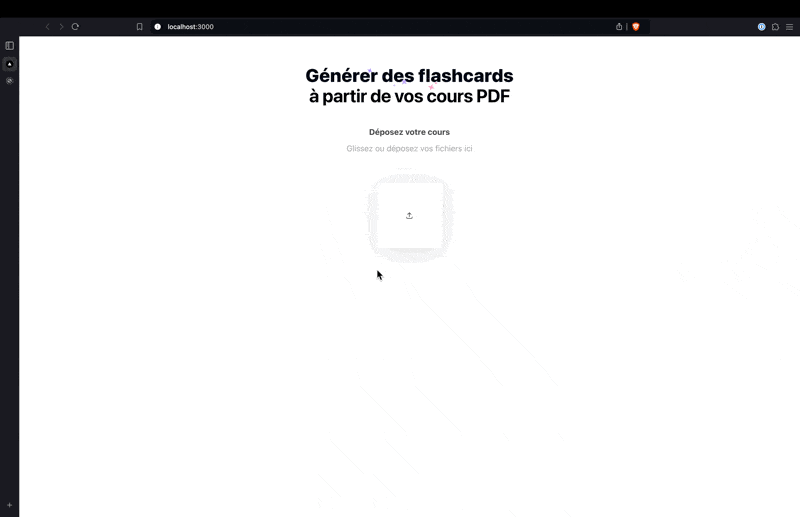

# Hackathon

Ce dépôt contient deux parties principales :

- **hackathon-frontend** : Le projet front-end pour l'interface utilisateur.
- **hackathon-backend** : Le projet back-end pour la gestion de l'API et des fonctionnalités de conversion de PDF en texte.

## Objectif du projet

Le projet "Hackathon" a pour but de créer une plateforme web qui permet aux utilisateurs de convertir leurs cours PDF en flashcards interactives. Ces flashcards sont générées à partir du contenu extrait du PDF et présentent des questions et réponses générées automatiquement.

## Fonctionnalités principales

- **Téléchargement de fichiers PDF** pour extraction du texte.
- **Utilisation de l'API OpenAI** pour générer des questions et des réponses à partir du texte extrait.
- **Affichage interactif** des questions et réponses sous forme de cartes flip.
- **Séparation claire entre le front-end (interface) et le back-end (API et logique de traitement).**

## Exemple d'utilisation

Voici un exemple d'utilisation du site où un utilisateur télécharge un fichier PDF et génère automatiquement des flashcards interactives :



---

## hackathon-frontend

### Technologies utilisées

- **Frontend** :
  - [React](https://reactjs.org/)
  - [Next.js](https://nextjs.org/)
  - [Tailwind CSS](https://tailwindcss.com/)

### Installation et démarrage

1. Clonez le dépôt :

   ```bash
   git clone https://github.com/Valentin-Droid/Hackathon.git
   ```

2. Accédez au dossier `hackathon-frontend` :

   ```bash
   cd hackathon/hackathon-frontend
   ```

3. Installez les dépendances :

   ```bash
   npm install
   ```

4. Créez un fichier `.env.local` avec les variables nécessaires (si nécessaire).

5. Lancez le projet en mode développement :

   ```bash
   npm run dev
   ```

   L'application sera disponible sur [http://localhost:3000](http://localhost:3000).

---

## hackathon-backend

### Technologies utilisées

- **Backend** :
  - [Node.js](https://nodejs.org/)
  - [Express.js](https://expressjs.com/)
  - [MariaDB](https://mariadb.org/)
  - Outils de conversion PDF en texte.

### Installation et démarrage

1. Accédez au dossier `hackathon-backend` :

   ```bash
   cd hackathon/hackathon-backend
   ```

2. Installez les dépendances :

   ```bash
   npm install
   ```

3. Créez un fichier `.env` pour ajouter les clés d'API (par exemple, pour l'API OpenAI).

4. Lancez le serveur back-end :

   ```bash
   npm run start
   ```

   Le serveur back-end sera disponible sur [http://localhost:3001](http://localhost:3001) ou un autre port si configuré.

### Fonctionnalités du backend

- **Conversion de PDF en texte** : Extraction automatique du contenu textuel des PDF.
- **Routes API pour gérer les données** : Des endpoints qui permettent de communiquer avec la base de données.

### Endpoints du backend

Endpoint obligatoire pour pouvoir générer une carte (fonctionne sans mise en place de base de données) :

- **POST /extract-pdf-text** : Qui permet de convertir un fichier pdf en texte.

Les endpoints suivants nécessitent une base de données (voir le readme du dossier hackathon-backend pour déployer la base de données en local si vous souhaitez tester ces endpoint via postman par exemple) mais non obligatoire pour utiliser le site dans sa V0.

- **GET /pdf** : Qui permet de récupérer les pdf enregistrer en base.
- **POST /pdf** : Qui permet d'enregistrer un pdf en base.
- **POST /statsaddpdf** : Qui permet de faire un +1 sur la statistique du nombre de pdf upload sur le site.
- **POST /statsaddcards** : Qui permet de faire un +1 sur la statistique du nombre de cartes générées sur le site.
- **POST /statsaddnote** : Qui permet de mettre à jour la moyenne des notes des cartes notées (pas encore mis en place sur le front, mais présent dans le back pour une future évolution du site).
- **GET /stats** : Qui retourne des statistiques sur l'utilisation du site (présent dans le back pour une future évolution du front).

## Auteur

[Valentin DRELON] - [valentin.drelon@ynov.com](mailto:valentin.drelon@ynov.com)

[Kellian KAUFFMANN] - [kellian.kauffmann@ynov.com](mailto:kellian.kauffmann@ynov.com)

[Anh Nguyen Hoang Phuong] - [hoangphuonganh.nguyen@ynov.com](mailto:hoangphuonganh.nguyen@ynov.com)

[Luca CHABOISSIER] - [luca.chaboissier@ynov.com](mailto:luca.chaboissier@ynov.com)
